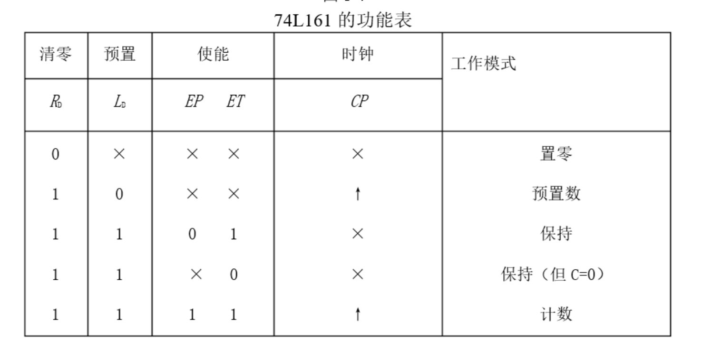
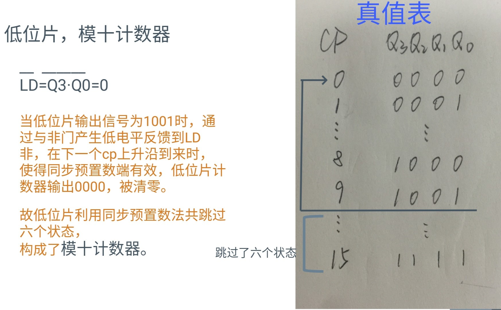
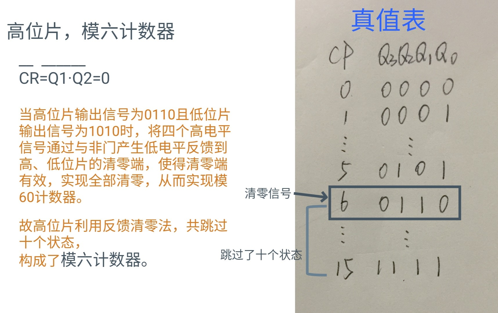
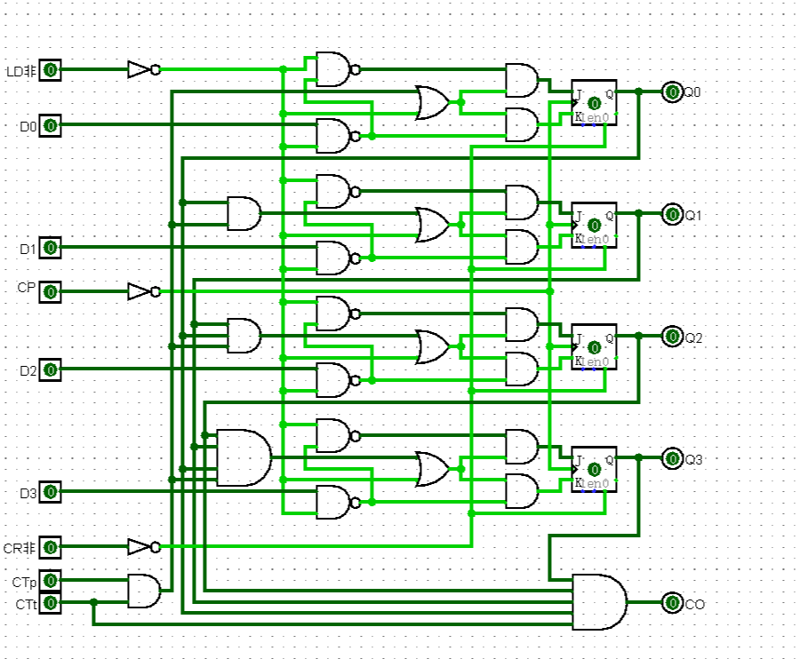
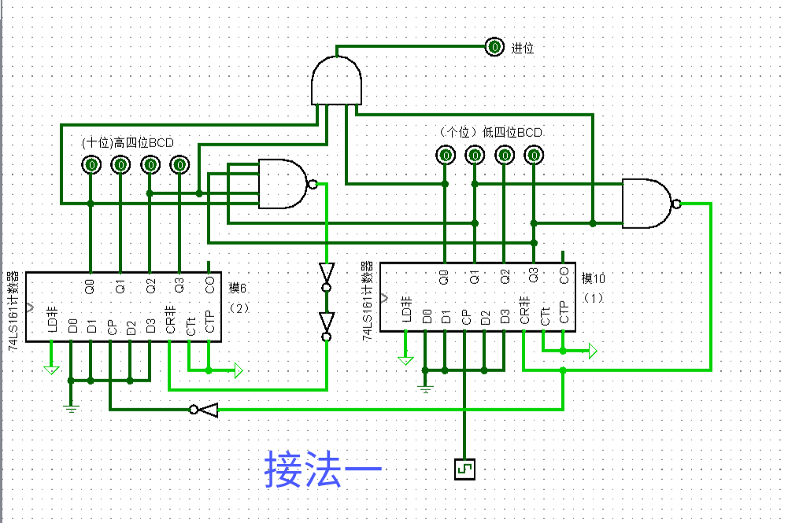
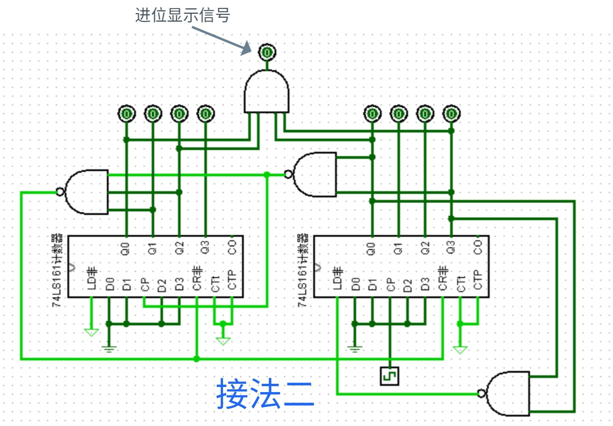
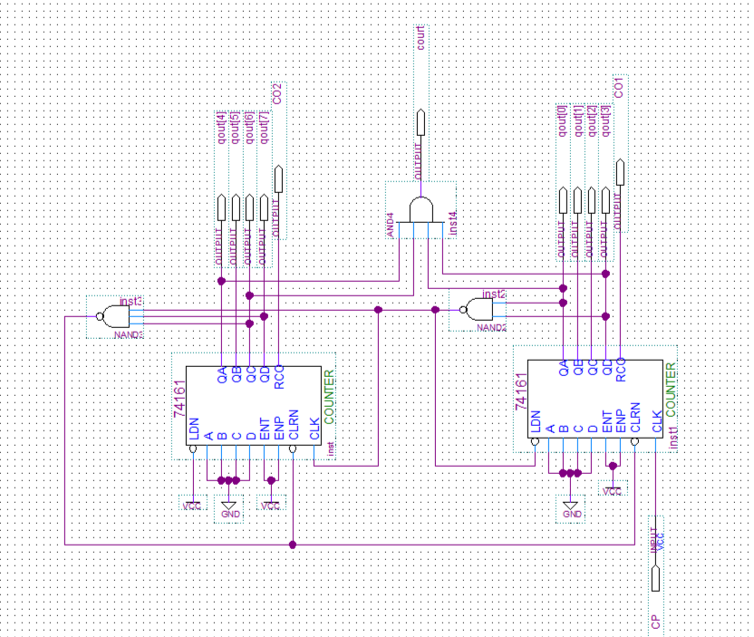
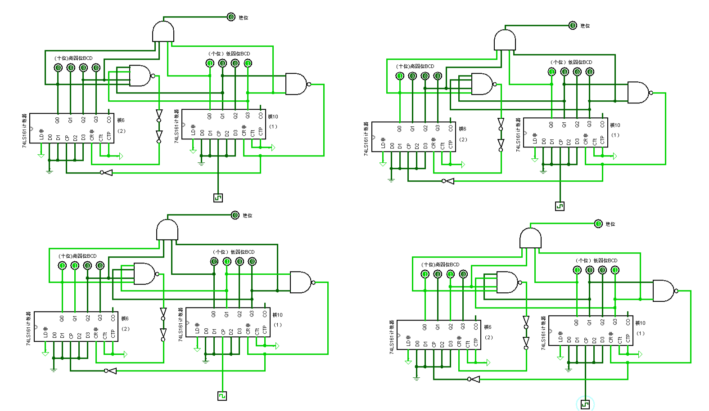
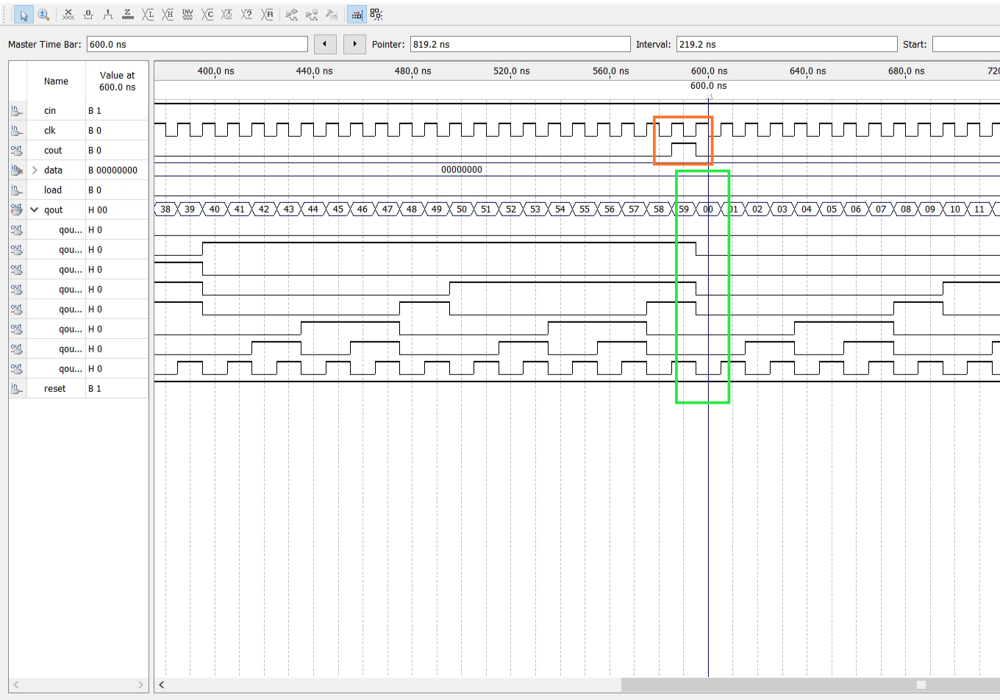

##### 一、分析：利用封装的74161完成带有异步复位端的模6和模10计数器，然后级联构成模为60的BCD码计数器：



​	由74161功能表可知要构成模6计数器和模10计数器，可以采用同步置数法:当达到需要的计数终点时反馈一个置数信号到LD非，使得输出Q3Q2Q1Q0=D3D2D1D0。也可以采用反馈清零法：当达到需要的计数终点时反馈一个清零信号到CR非，使得输出Q3Q2Q1Q0=0000。

##### 二、设计：





##### 三、logisim实现：

1.Logisim环境下设计并封装74161：




​	

3.利用封装的74161完成带有异步复位端的模6和模10计数器，然后连接构成模为60的BCD码计数器：



​	右边74161作为低位片，利用反馈清零法，从0000计数到1010清零（瞬态），因此实际有效计数从0000到1001，构成了模10计数器。

​	左边74161作为高位片，同样利用反馈清零法，当从0000计数到0101同时低位片进位到1010时清零，构成模6计数器。

​	左右两片74161级联，低位片每计10个数清零的同时向高位片发送一个下降沿的时钟信号，高位片计1，直到高位片为0101（5），低位片为1001（9）时产生进位，此时低位片再加1到1010时整体清零（瞬态），由此构成了模为60的BCD码计数器。




##### 四、quartus实现：

1.在quartus环境下完成电路连接电路：



2.同样也可直接用verilog代码实现模60 BCD码计数器计数器：

```
//模为60的BCD码计数器
module count60(
input clk,
input cin,
input reset,
input load,
input [7:0]data,
output reg [7:0]qout,
output cout
);
always @(posedge clk or negedge reset)begin
    if(!reset)
    qout<=0;
    else if(load)
    qout<=data;
    else if(cin)
        begin
            if(qout[3:0]==9)
                begin
                    qout[3:0]<=0;
                    if(qout[7:4]==5)
                        qout[7:4]<=0;
                     else qout[7:4]<=qout[7:4]+1'b1;   
                end
                
            else qout[3:0]<= qout[3:0]+1'b1;
        end
end
assign cout=((qout==8'h59)&cin)?1:0;
endmodule

```

##### 五、仿真结果：

1.logisim:



说明：低位片每计10个数高位片成功加1，整体从00计数到59时进位输出成功为1，再来一个cp信号整体清零回到0000，重新开始新一轮计数。

2.quartus:

)

​                                  说明：当从00计数到59时产生进位，再来一个cp信号整体清零回到00，重新开始新一轮计数。

##### 六、扩展：

1.除了反馈清零法，也可以用同步置数法来做，高低位片可以都用清零法，也可以都用置数法，也可以高位片清零法低位片置数法，解法并不唯一。

2.BCD码计数器和非BCD码计数器有什么不同？

BCD码计数器相当于将非BCD码计数器的每一位转译为bcd码，既用4位二进制数表示每一位十进制数。BCD码计数器的输出端可以直接通过驱动器连接7段数码管，实现计数的显示功能。
